# NXP Application Code Hub

# PCF85063AT RTC driver with demo app running on FRDM-MCXN947 and FRDM-MCXA153
The PCF85063AT is a CMOS Real-Time Clock (RTC) and calendar optimized for low power consumption. An offset register allows fine-tuning of the clock. All addresses and data are transferred serially via the two-line bidirectional I2C-bus.

This demo application provides a command line interface which allows the user to easily explore the different functions of the driver to use the RTC controller features for interrupts, offset modes, correction interrupts and alarm control.

### PCF85063AT Block Diagram

[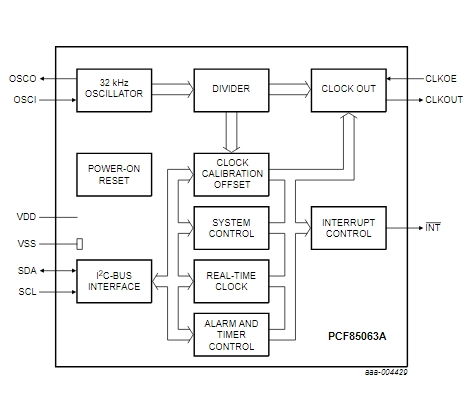](PCF85063AT_block_diagram.PNG)

### Key Features of PCF85063AT RTC driver

- Provides year, month, day, weekday, hours, minutes, and seconds information.
- On board Power LED (D1) and Interrupt LED (D2) to detect the power supply and interrupt generation respectively.
- Minute, Half minute and alarm interrupt functionalities.
- PCF85063AT supports countdown timer feature to get an interrupt in the range from 244 μs to 4 hours 15 min.
- Programmable clock output for peripheral devices (32.768 kHz, 16.384 kHz, 8.192 kHz, 4.096 kHz, 2.048kHz, 1.024 kHz, and 1 Hz) 
- Clock operating voltage: 0.9 V to 5.5 V
- Provides two offset modes under which correction of clock pulse can be done and tested using correction interrupts. 

#### Boards: FRDM-MCXA153, FRDM-MCXN947
#### Categories: User Interface
#### Peripherals: I2C
#### Toolchains: MCUXpresso IDE

## Table of Contents
1. [Software](#step1)
2. [Hardware](#step2)
3. [Setup](#step3)
4. [Results](#step4)
5. [Support](#step6)
6. [Release Notes](#step7)

## 1. Software
- [IoT Sensing SDK (ISSDK) v1.8](https://nxp.com/iot-sensing-sdk) offered as middleware in MCUXpresso SDK for supported platforms
- [MCUXpresso IDE v11.9.0](https://www.nxp.com/design/design-center/software/development-software/mcuxpresso-software-and-tools-/mcuxpresso-integrated-development-environment-ide:MCUXpresso-IDE)

## 2. Hardware
- FRDM-MCXN947 and FRDM-MCXA153 MCU board
- [PCF85063AT RTC Driver](https://www.nxp.com/products/analog-and-mixed-signal/real-time-clocks/tiny-real-time-clock-calendar-with-alarm-function-and-ic-bus:PCF85063A) 
- Personal Computer
- Mini/Micro USB Type C USB cable
- Jumper Wires

## 3. Setup
### 3.1 Step 1: Download and Install required Software(s)
- Install MCUXpresso IDE 11.9.0
- Download and Install [MCUXpresso SDK v2.14.0 for FRDM-MCXN947](https://mcuxpresso.nxp.com/en/builder?hw=FRDM-MCXN947). Make sure to select ISSDK  middleware while building SDK.
- Download and Install [MCUXpresso SDK v2.14.2 for FRDM-MCXA153](https://mcuxpresso.nxp.com/en/builder?hw=FRDM-MCXA153). Make sure to select ISSDK  middleware while building SDK.
- Install Git v2.39.0 (for cloning and running west commands).
- Install Putty/Teraterm for UART.
 
### 3.2 Step 2: Clone the APP-CODE-HUB/dm-pcf85063at-rtc-driver-with-demo-app
- Clone this repository to get the example projects:
- Change directory to cloned project folder: 
    cd *dm-pcf85063at-rtc-driver-with-demo-app*
 
**Note:** If you are using Windows to clone the project, then please configure filename length limit using below command
**git config --system core.longpaths true**

### 3.3 Step 3: Build example projects
- Open MCUXpresso IDE and select a directory to create your workspace.
- Install MCXUpresso SDK 2.14.x for FRDM-MCX947, FRDM-MCXA153 (drag and drop SDK zip into "Installed SDK" view) into MCUXpresso IDE.
- Go to "Quickstart Panel" and click on "Import Project(s) from file system",
- Select "Project directory (unpacked)" and browse to the cloned project folder.
- Select example projects that you want to open and run.
- Right click on project and select build to start building the project.

## 4. Test Application Steps
- User needs to make the connection between shield board (PCF85063AT) and Base boards (MCXA153 & MCXN947) using jumper wires. 

[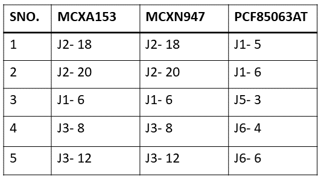](JUMPER_SETTING.PNG)

[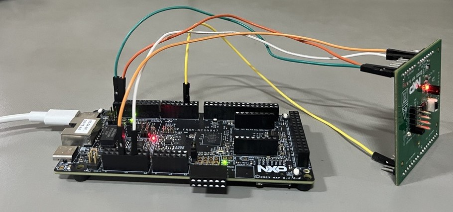](connections.PNG)
- User needs to check COM port after connecting USB cable between Host PC and Target Board via device manager.

- Open PUTTY/Teraterm application installed on your Windows PC with Baudrate 115200 and assigned COM port as mentioned in above step.

- After right click on project and select "Debug As", Demo application will run in interactive mode. When the demo runs successfully, you can see the logs printed on the terminal.

## 4.1 Logs Results

**Main Menu will look like this**

[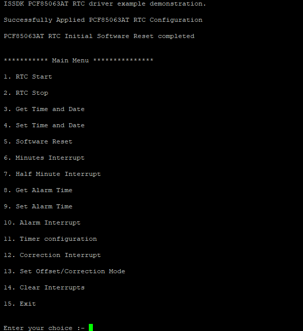](log1.PNG)

**Enter #1 to Start the RTC** 

**Enter #4 to set time and date** 

- User can select either 12 hrs or 24 hrs mode, according to which further prompts will come. 
- Select time and date as per requirements then press enter. 

  [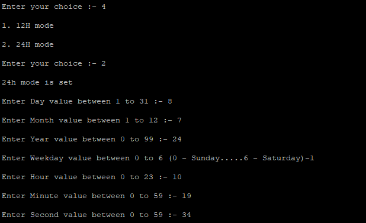](log2.PNG)

- User can see the selected time and date by entering #3. 

  

**To enable Minute / Half Minute interrupt** 

- To enable Minute interrupt, Enter #6 and for Half Minute interrupt, Enter #7

- For eg: Enter #6, then enter #1 to enable the Minute interrupt and wait for a minute to recieve the interrupt logs.

  

- User has to enter #2 to disable the interrupt.

  

**Enter #9 to set an alarm**   

- User has to select the further values to set an alarm then press enter.
  
  [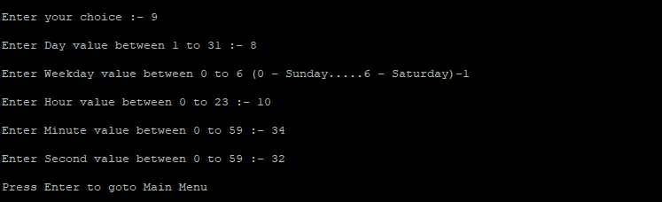](log7.PNG)

- User has to enter #10 to enable the alarm interrupt, in which they have to choose which type of alarm interrupt they want as per the logs shown then press enter. 
  
  [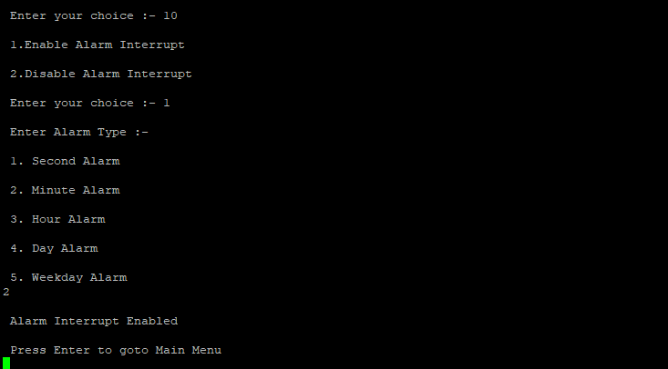](log8.PNG)

- User can see their selected alarm values by entering #8.

  

- After recieving the alarm interrupt prompt, user has to disable the alarm interrupt by entering #10

  [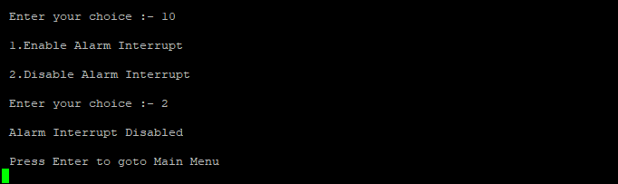](log25.PNG)    

**Enter #11 to set Timer configurations** 

NOTE: The timer has four selectable source clocks allowing for countdown periods in the range from 244 μs to 4 hours 15 min.

[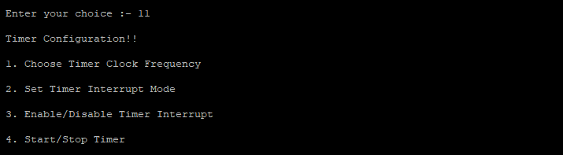](log10.PNG)

- To select timer clock frequency, enter #1

  

- To select the value of frequency, enter according to the logs shown.(for eg: here we selected 3rd slab, 2 seconds clock.)

  

- To select Timer interrupt mode, enter #1 to generate pulse and #2 to follow timer flag condition(need to clear the interrupt to generate another interrupt). 
  - Here we have choosen pulse mode.

  [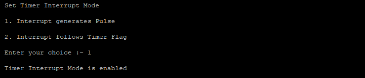](log13.PNG)

- Enter #1 to enable timer interrupt

  [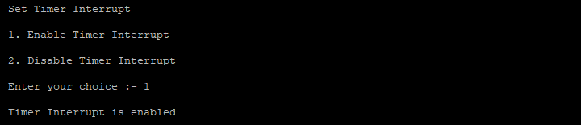](log14.PNG)

- Enter #1 to enable Timer then Press enter
  
  [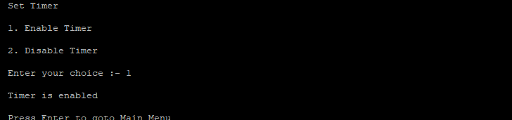](log15.PNG)

- Interrupt will be generated as pulses until Timer interrupt and Timer is not disabled.

  [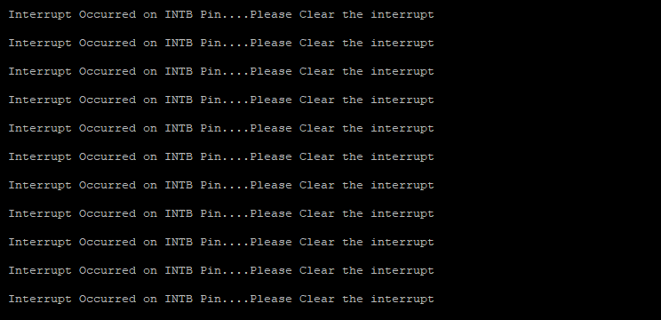](log16.PNG)

To stop the generation of interrupts:  

- Enter #11 to disable the Timer interrupt and Timer as shown below:

  [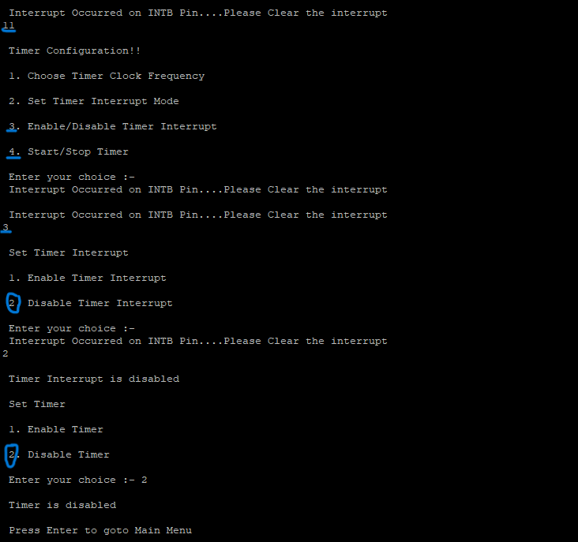](log17.PNG)

**Enter #12 to Set Correction Interrupt** 

An offset register is be used to implement functions, such as Accuracy tuning, Aging adjustment & Temperature compensation so the correction is made by adding or subtracting clock correction pulses.

- User can enable/disable correction interrupt as shown in logs.

Note: User needs to enable the correction interrupt first in order to see the corrected clock pulse in the form of interrupts. 

  [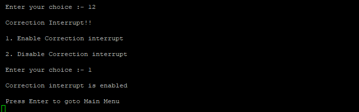](log19.PNG)

**Enter #13 to Set Offset/Correction Mode** 

- User can select either Normal mode(enter #1) or Course mode(enter #2) as per reqd.
  - Here. we have choosen Course mode in which we have to wait maximum upto 4 minutes to get interrupts. And for Normal mode, we have to wait maximum upto 2 hours to get interrupts. 

- User needs to mention the offset value as per the range mentioned.

  [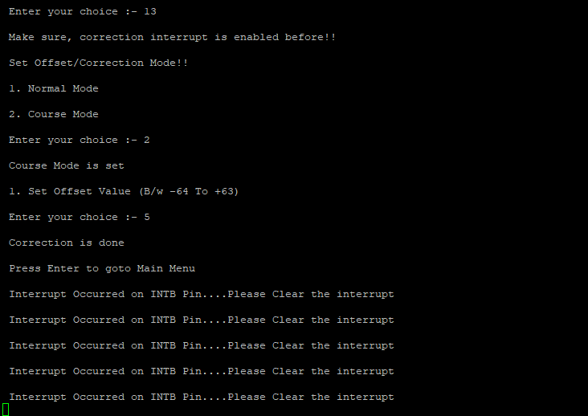](log20.PNG)

To stop the generation of Interrupts:  

- Enter #12 to disable the correction interrupt as shown below. 

  [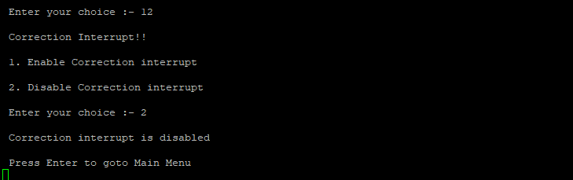](log21.PNG)

**Enter #14 to clear any interrupts** 

**Enter #5 to perform Software RESET** 

**Enter #2 to stop the RTC** 

**Enter #15 to exit the RTC** 

## 5. Support

#### Project Metadata
<!----- Boards ----->
 

<!----- Categories ----->

<!----- Peripherals ----->

<!----- Toolchains ----->

Questions regarding the content/correctness of this example can be entered as Issues within this GitHub repository.

>**Warning**: For more general technical questions regarding NXP Microcontrollers and the difference in expected funcionality, enter your questions on the [NXP Community Forum](https://community.nxp.com/)

## 6. Release Notes
| Version | Description / Update                           | Date                        |
|:-------:|------------------------------------------------|----------------------------:|
| 1.0     | Initial release on Application Code Hub        | July 12th 2024 |

